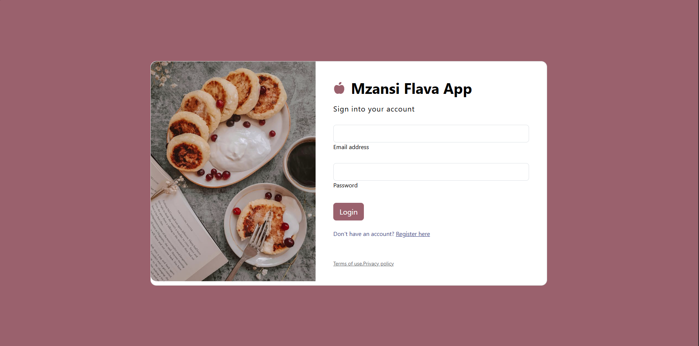
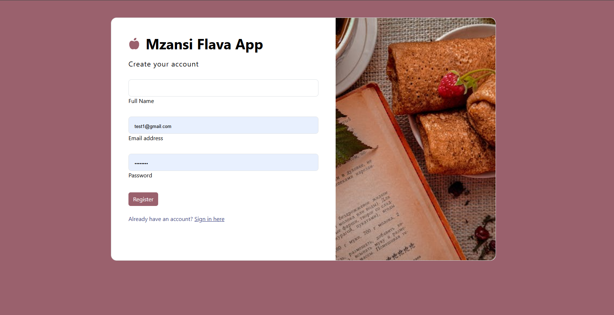
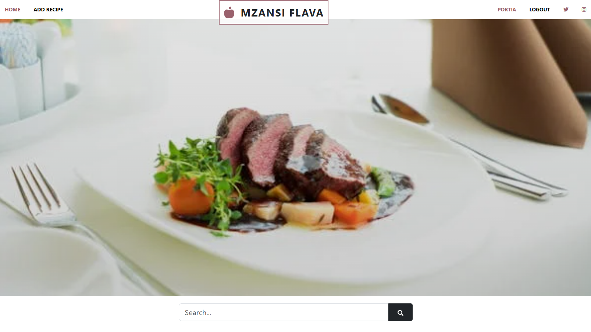
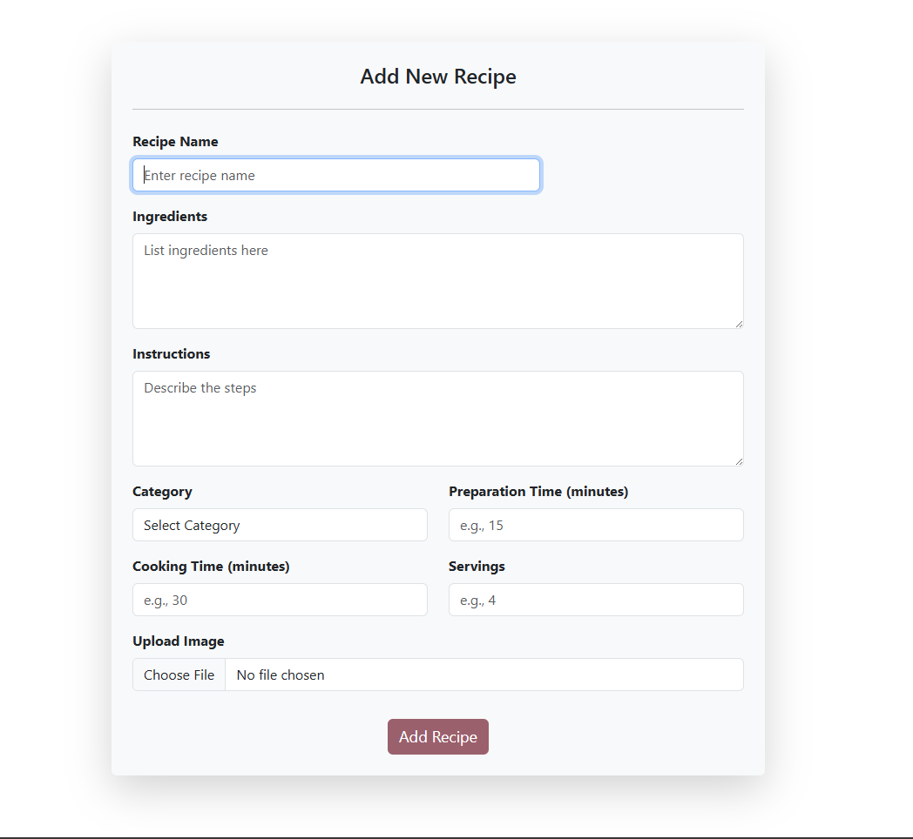
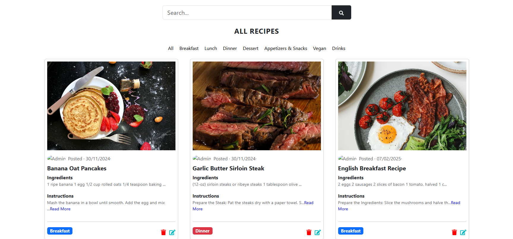
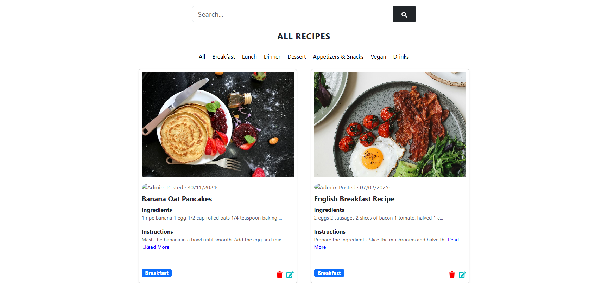

Sure! Here's a README file for your Recipe App:

# Recipe App

This project outlines the implementation of a **Recipe App** using React JS, Bootstrap, and JSON Server for the database. It demonstrates user registration, login, and CRUD operations for managing recipes.

## Features
- **Frontend**: React JS and Bootstrap
- **Backend**: JSON Server
- **User Authentication**: Users must register and log in to save their recipes.
- **CRUD Operations**: Users can create, read, update, and delete their recipes.
- **Logout**: Users can log out of their accounts.

---

## Prerequisites
1. **Install Node.js**: Download Node.js from [here](https://nodejs.org/).
2. **Install JSON Server**: Ensure JSON Server is installed globally:
   ```bash
   npm install -g json-server
   ```

---

## Step-by-Step Guide

### 1. Set Up the Project
Clone the repository and install dependencies:
```bash
git clone <repository-url>
cd recipe-app
npm install
```

### 2. Start JSON Server
Create a `db.json` file for your JSON Server database and start the server:
```bash
json-server --watch db.json --port 2000
```

### 3. Start the React App
In a new terminal window, start the React development server:
```bash
npm start
```

### 4. Register and Log In
Users must register and log in to access their recipes. The authentication data is stored in the JSON Server database.

### 5. CRUD Operations
Users can perform the following operations on their recipes:

#### a. Create a Recipe
Users can add new recipes by filling out a form and submitting it.

#### b. Read Recipes
Users can view a list of their saved recipes.

#### c. Update a Recipe
Users can edit their existing recipes and save the changes.

#### d. Delete a Recipe
Users can delete recipes they no longer need.

### 6. Logout
Users can log out of their accounts, which will clear their session data.

---

## Example JSON Server Data

Here's an example of how your `db.json` file might look:

```json
{
  "users": [
    {
      "id": 1,
      "username": "john_doe",
      "password": "password123"
    }
  ],
  "recipes": [
    {
      "id": 1,
      "userId": 1,
      "name": "Spaghetti Bolognese",
      "ingredients": ["spaghetti", "ground beef", "tomato sauce"],
      "instructions": "Cook spaghetti. Brown the beef. Mix with sauce.",
      "category": "Breakfast",
      "prepTime": "15",
      "servings": "7",
      "cookTime": "45",
      "imageUrl": "http://res.cloudinary.com/dmpmbgngu/image/upload/v1732959545/jyqxjhw1gfpu996isyvf.jpg",
      "date": "30/11/2024",
    }
  ]
}
```

---

## Verification
1. Verify JSON Server is running:
   ```bash
   curl http://localhost:2000/users
   ```
2. Verify React App is running:
   Open your browser and navigate to `http://localhost:3000`.

---

### Quiz Start







